# Sevens Wallet React

A comprehensive React library for building custom Solana wallet interfaces. Built on top of the Phantom Wallet Adapter interface with full compatibility and extended functionality.

## Features

### Core Wallet Adapter
- **Full Phantom API Compatibility**: Drop-in replacement for Phantom wallet with identical interface
- **Solana Integration**: Built on @solana/wallet-adapter-base for seamless blockchain interaction
- **Custom Network Support**: Configurable endpoints for mainnet, devnet, testnet, and custom networks
- **Auto-connection**: Persistent wallet sessions with automatic reconnection

### Comprehensive UI Components
- **Complete Wallet Management**: Create, restore, import, and manage multiple wallets
- **Transaction Interface**: User-friendly transaction signing with detailed previews
- **Token Operations**: Full SPL token support with mint, transfer, and burn capabilities
- **Settings Panel**: Network switching, password management, and language preferences
- **Security Components**: Password-protected operations with encrypted storage

### Multi-language Support
- **4 Languages**: English, Ukrainian, Spanish, German
- **210+ UI Translations**: Complete interface localization
- **Dynamic Language Switching**: Real-time language changes
- **Cultural Formatting**: Localized number and currency formatting

### Advanced Security
- **Encrypted Storage**: CryptoJS-based encryption for sensitive data
- **Password Protection**: Secure access to all critical operations
- **Transaction Validation**: Pre-signing validation and simulation
- **Private Key Safety**: Secure handling and storage of cryptographic keys

### Developer Experience
- **TypeScript Support**: Full type definitions included
- **React 18 Compatible**: Built for modern React applications
- **Modular Architecture**: Import only the components you need
- **Comprehensive Documentation**: Detailed API reference and examples

## Installation

```bash
npm install custom-solana-wallet-react
```

## Quick Start

### Basic Setup

```jsx
import React from 'react'
import {
  SevensWalletProvider,
  SevensWalletInitializer,
  WalletContent
} from 'sevens-wallet-react'

function App() {
  return (
    <SevensWalletProvider>
      <SevensWalletInitializer>
        <WalletContent />
      </SevensWalletInitializer>
    </SevensWalletProvider>
  )
}

export default App
```

### With Custom Configuration

```jsx
import {
  SevensWalletConfigurableProvider,
  SevensWalletInitializer,
  WalletContent
} from 'sevens-wallet-react'

// Custom configuration
const customConfig = {
  CONNECTION_ENDPOINTS: {
    main: 'https://your-custom-rpc.com',
    dev: 'https://your-dev-rpc.com'
  },
  SEVENS_TOKEN_IDL_PATH: 'https://your-domain.com/token-metadata.json',
  PASSWORD_MIN_LENGTH: 8,
  LANGUAGES: {
    en: 'English',
    uk: 'Українська',
    fr: 'Français'  // Add custom language
  }
}

function App() {
  return (
    <SevensWalletConfigurableProvider config={customConfig}>
      <SevensWalletInitializer>
        <WalletContent />
      </SevensWalletInitializer>
    </SevensWalletConfigurableProvider>
  )
}
```

### With Solana Wallet Adapter

```jsx
import { useMemo } from 'react'
import { ConnectionProvider, WalletProvider } from '@solana/wallet-adapter-react'
import { SevensWalletAdapter } from 'sevens-wallet-react'

function App() {
  const wallets = useMemo(() => [
    new SevensWalletAdapter(),
  ], [])

  return (
    <ConnectionProvider endpoint="https://api.mainnet-beta.solana.com">
      <WalletProvider wallets={wallets}>
        {/* Your app components */}
      </WalletProvider>
    </ConnectionProvider>
  )
}
```

## Components

### Core Components

#### `SevensWalletProvider`
Main provider component that manages wallet state and context.

```jsx
import { SevensWalletProvider } from 'sevens-wallet-react'

<SevensWalletProvider>
  {/* Your wallet components */}
</SevensWalletProvider>
```

#### `SevensWalletConfigurableProvider`
Advanced provider with external configuration support.

```jsx
import { SevensWalletConfigurableProvider } from 'sevens-wallet-react'

const config = {
  CONNECTION_ENDPOINTS: {
    main: 'https://api.mainnet-beta.solana.com'
  }
}

<SevensWalletConfigurableProvider config={config}>
  {/* Your wallet components */}
</SevensWalletConfigurableProvider>
```

#### `SevensWalletInitializer`
Handles wallet initialization and authentication flow.

```jsx
import { SevensWalletInitializer } from 'sevens-wallet-react'

<SevensWalletInitializer>
  {/* Components that need wallet access */}
</SevensWalletInitializer>
```

#### `WalletContent`
Complete wallet interface with all functionality.

```jsx
import { WalletContent } from 'sevens-wallet-react'

<WalletContent />
```

### UI Components

#### `WalletBlock`
Main wallet display with balance and quick actions.

```jsx
import { WalletBlock } from 'sevens-wallet-react'

<WalletBlock />
```

#### `SendCoins`
Component for sending SOL to other addresses.

```jsx
import { SendCoins } from 'sevens-wallet-react'

<SendCoins />
```

#### `Settings`
Comprehensive settings panel for wallet configuration.

```jsx
import { Settings } from 'sevens-wallet-react'

<Settings />
```

#### `SignTransaction` / `SignMessage`
Components for transaction and message signing.

```jsx
import { SignTransaction, SignMessage } from 'sevens-wallet-react'

<SignTransaction transaction={transaction} />
<SignMessage message={message} />
```

### Form Elements

```jsx
import {
  Blocks,
  Inputs,
  Buttons,
  Messages
} from 'sevens-wallet-react'

// Styled form components matching wallet design
<Inputs.Password placeholder="Enter password" />
<Buttons.Primary onClick={handleSubmit}>Submit</Buttons.Primary>
<Messages.Error>Error message</Messages.Error>
```

## API Reference

### Hooks

#### `useWalletContext`
Access wallet state and operations.

```jsx
import { useWalletContext } from 'sevens-wallet-react'

function MyComponent() {
  const {
    currentWallet,
    isLocked,
    unlockWallet,
    lockWallet,
    createWallet,
    // ... other wallet operations
  } = useWalletContext()

  return (
    <div>
      {currentWallet ? (
        <p>Wallet: {currentWallet.name}</p>
      ) : (
        <button onClick={createWallet}>Create Wallet</button>
      )}
    </div>
  )
}
```

### Adapter

#### `SevensWalletAdapter`
Solana wallet adapter implementation.

```jsx
import { SevensWalletAdapter } from 'sevens-wallet-react'

const adapter = new SevensWalletAdapter()

// Standard wallet adapter methods
await adapter.connect()
await adapter.disconnect()
const signature = await adapter.signTransaction(transaction)
const signature = await adapter.signMessage(message)
```

### Configuration Hooks

#### `useWalletConfig`
Access current wallet configuration in React components.

```jsx
import { useWalletConfig } from 'sevens-wallet-react'

function MyComponent() {
  const config = useWalletConfig()

  return (
    <div>
      <p>Main RPC: {config.CONNECTION_ENDPOINTS.main}</p>
      <p>Min Password Length: {config.PASSWORD_MIN_LENGTH}</p>
    </div>
  )
}
```

#### Configuration Utilities

```jsx
import {
  getConfig,
  getConfigValue,
  safeGetConfig
} from 'sevens-wallet-react'

// Get full config (React context required)
const config = getConfig()

// Get specific value with fallback
const minLength = getConfigValue('PASSWORD_MIN_LENGTH', 6)

// Safe config access (works everywhere)
const safeConfig = safeGetConfig()
```

## Configuration

### External Configuration

The library supports external configuration to override default settings without modifying package files.

#### Method 1: Using SevensWalletConfigurableProvider

```jsx
import { SevensWalletConfigurableProvider } from 'sevens-wallet-react'

const customConfig = {
  CONNECTION_ENDPOINTS: {
    main: 'https://your-mainnet-rpc.com',
    dev: 'https://your-devnet-rpc.com',
    custom: 'https://your-custom-network.com'
  },
  SEVENS_TOKEN_IDL_PATH: 'https://your-api.com/token-metadata.json',
  PASSWORD_MIN_LENGTH: 8,
  PASSWORD_REPEAT_DELAY_SECONDS: 10,
  LANGUAGES: {
    en: 'English',
    uk: 'Українська',
    es: 'Español',
    de: 'Deutsch',
    fr: 'Français'  // Add new language
  }
}

function App() {
  return (
    <SevensWalletConfigurableProvider config={customConfig}>
      {/* Your app components */}
    </SevensWalletConfigurableProvider>
  )
}
```

#### Method 2: Using Separate Config Provider

```jsx
import {
  SevensWalletConfigProvider,
  SevensWalletProvider,
  useWalletConfig
} from 'sevens-wallet-react'

function App() {
  return (
    <SevensWalletConfigProvider config={customConfig}>
      <SevensWalletProvider>
        <MyWalletComponents />
      </SevensWalletProvider>
    </SevensWalletConfigProvider>
  )
}

// Access config in components
function MyComponent() {
  const config = useWalletConfig()
  const endpoint = config.CONNECTION_ENDPOINTS.main

  return <div>Connected to: {endpoint}</div>
}
```

### Default Configuration

```javascript
// Default configuration (read-only in npm package)
{
  "CONNECTION_ENDPOINTS": {
    "main": "https://api.mainnet-beta.solana.com",
    "dev": "https://api.devnet.solana.com",
    "local": "http://localhost:8899",
    "custom": ""
  },
  "SEVENS_TOKEN_IDL_PATH": "https://api.example.com/token-metadata.json",
  "STORAGE_WALLET_KEY": "sevens_wallet",
  "STORAGE_WALLET_STATE_KEY": "sevens_wallet_state",
  "STORAGE_WALLET_TOKENS_KEY": "sevens_wallet_tokens",
  "PASSWORD_MIN_LENGTH": 6,
  "PASSWORD_REPEAT_DELAY_SECONDS": 5,
  "RELOAD_AFTER_CHANGES_SECONDS": 3
}
```

### Language Configuration

```javascript
// Supported languages
{
  "LANGUAGES": {
    "en": "English",
    "uk": "Українська",
    "es": "Español",
    "de": "Deutsch"
  }
}
```

### Security Settings

```javascript
{
  "PASSWORD_MIN_LENGTH": 6,
  "PASSWORD_REPEAT_DELAY_SECONDS": 5,
  "RELOAD_AFTER_CHANGES_SECONDS": 3
}
```

## Security Features

- **Encrypted Local Storage**: All sensitive data encrypted with AES
- **Password Protection**: Required for all critical operations
- **Session Management**: Automatic locking after inactivity
- **Transaction Validation**: Pre-signing simulation and validation
- **Error Handling**: Secure error messages without data leakage

## Internationalization

The library includes complete translations for:

- **English (en)**: Default language
- **Ukrainian (uk)**: Full localization
- **Spanish (es)**: Complete translation
- **German (de)**: Full language support

All UI text, error messages, and help content are fully localized.

## Responsive Design

- Mobile-first responsive design
- Touch-friendly interface elements
- Adaptive layouts for all screen sizes
- Progressive enhancement for desktop features

## UI Screenshots

### Core Wallet Interface

<div align="center">
  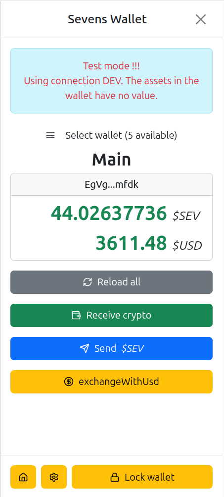
  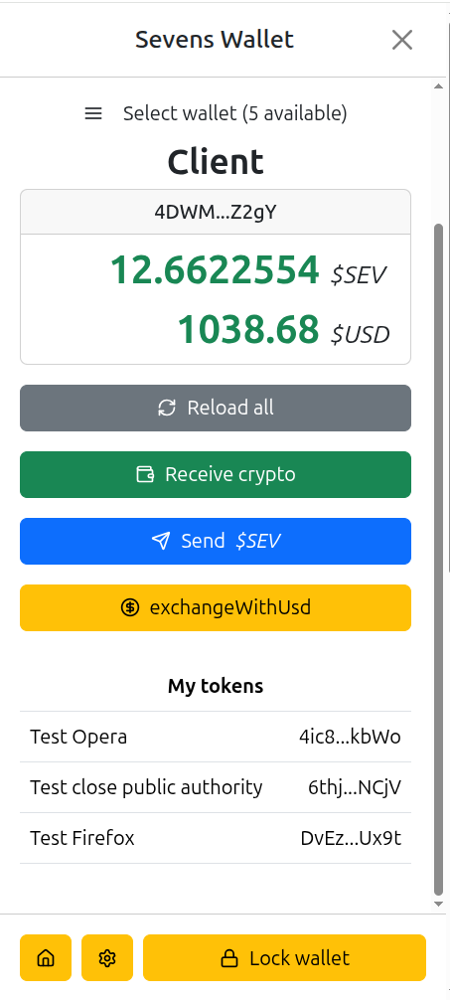
</div>

*Main wallet interface with balance display and token management*

### Authentication & Security

<div align="center">
  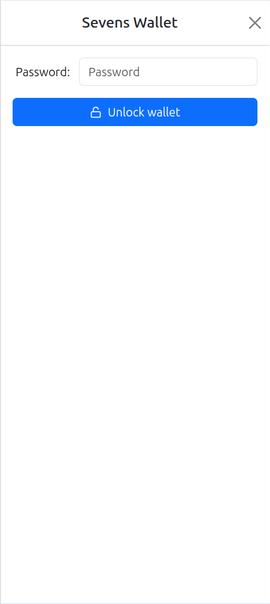
  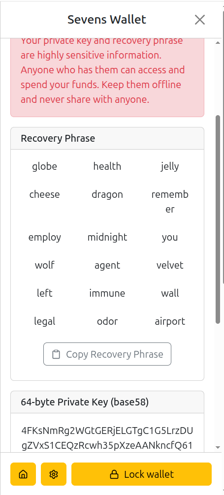
</div>

*Secure authentication and private key management*

### Multi-Wallet Management

<div align="center">
  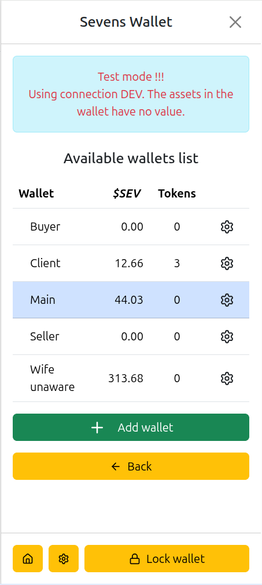
  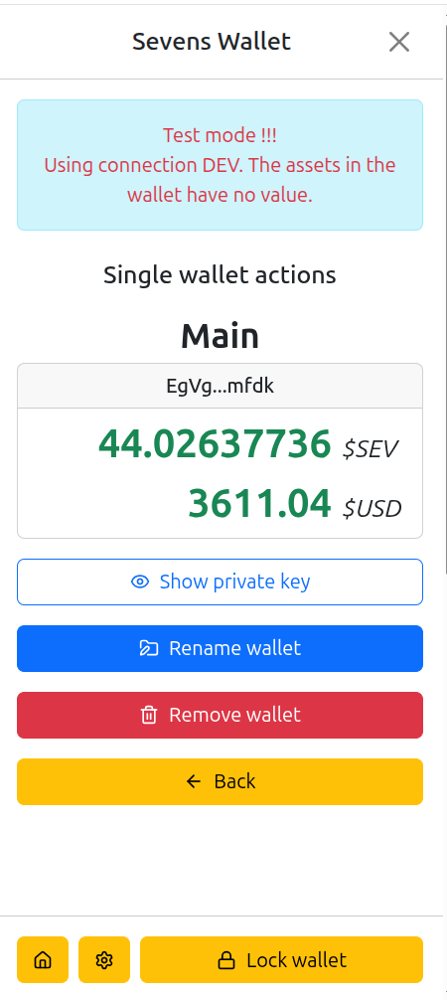
</div>

*Multiple wallet support with individual wallet management*

### Wallet Creation & Recovery

<div align="center">
  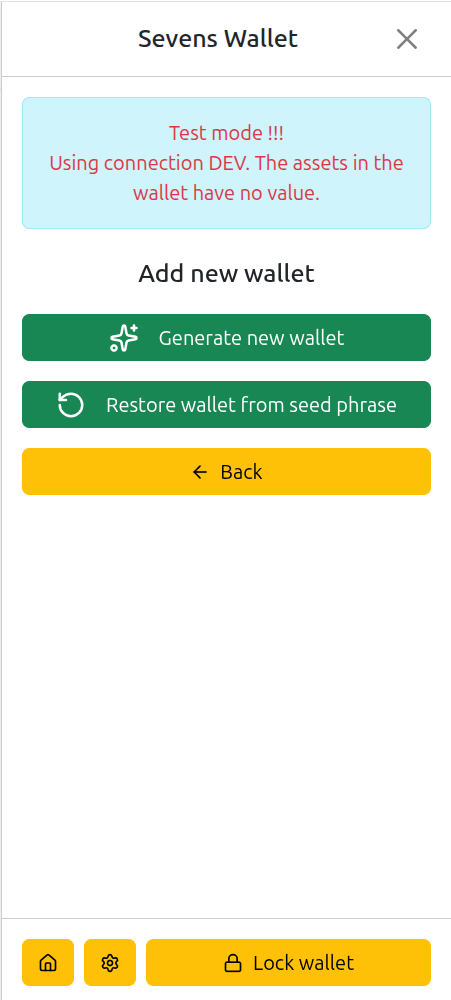
  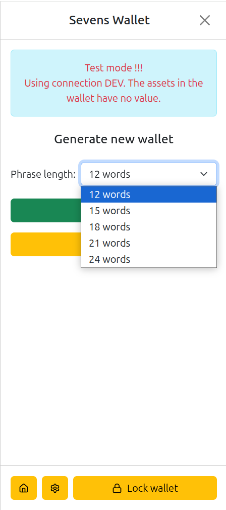
</div>

<div align="center">
  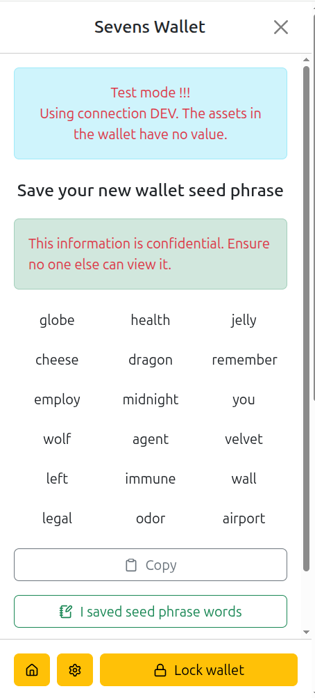
  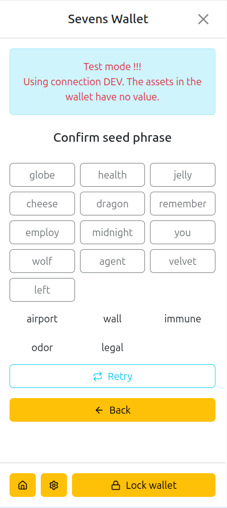
</div>

*Complete wallet creation flow with secure seed phrase management*

### Transaction Operations

<div align="center">
  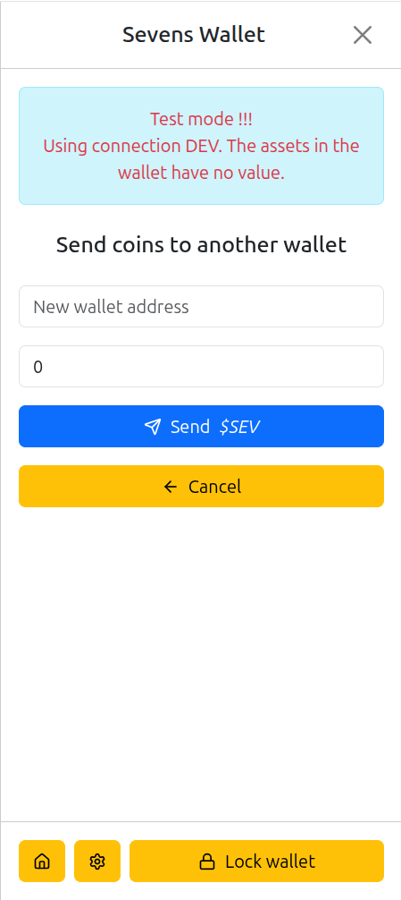
  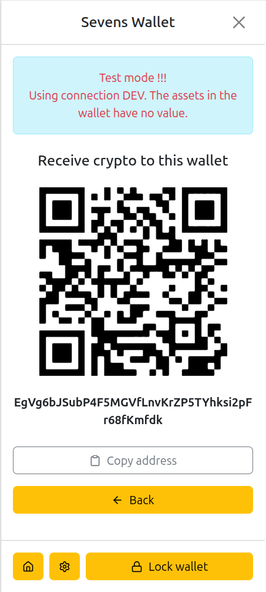
</div>

*Send and receive cryptocurrency with QR code support*

### Token Management

<div align="center">
  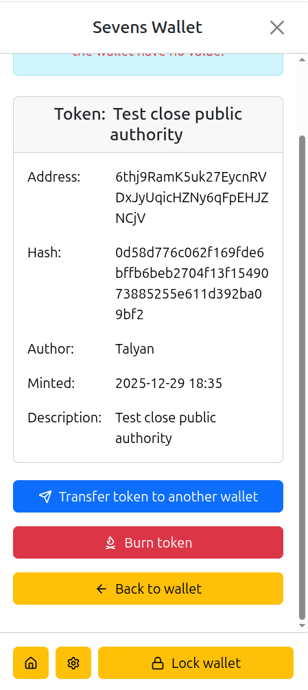
  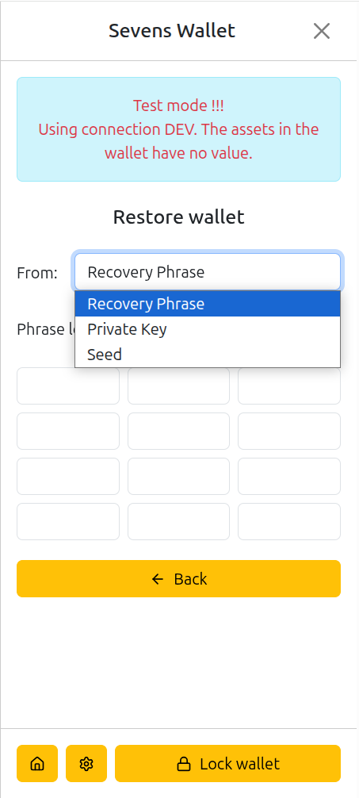
</div>

*Detailed token information and wallet recovery options*

### Settings & Configuration

<div align="center">
  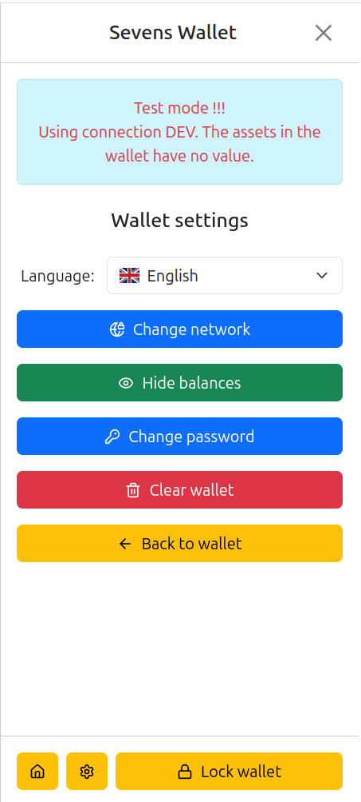
  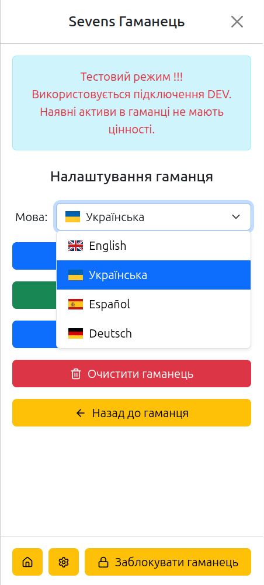
</div>

<div align="center">
  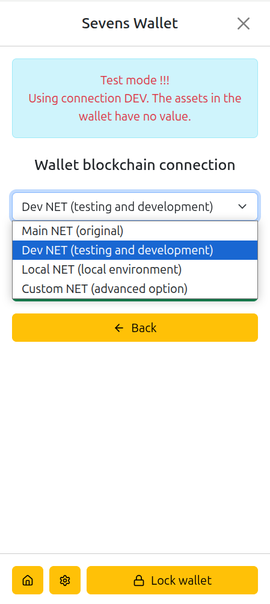
</div>

*Comprehensive settings with multi-language support and network configuration*

## Wallet Technical Workflows

### Wallet Initialization & Authentication Workflow

#### Process Overview
The wallet initialization process handles secure wallet creation, password setup, and encrypted storage with automatic session management and multi-wallet support.

#### Detailed Technical Flow

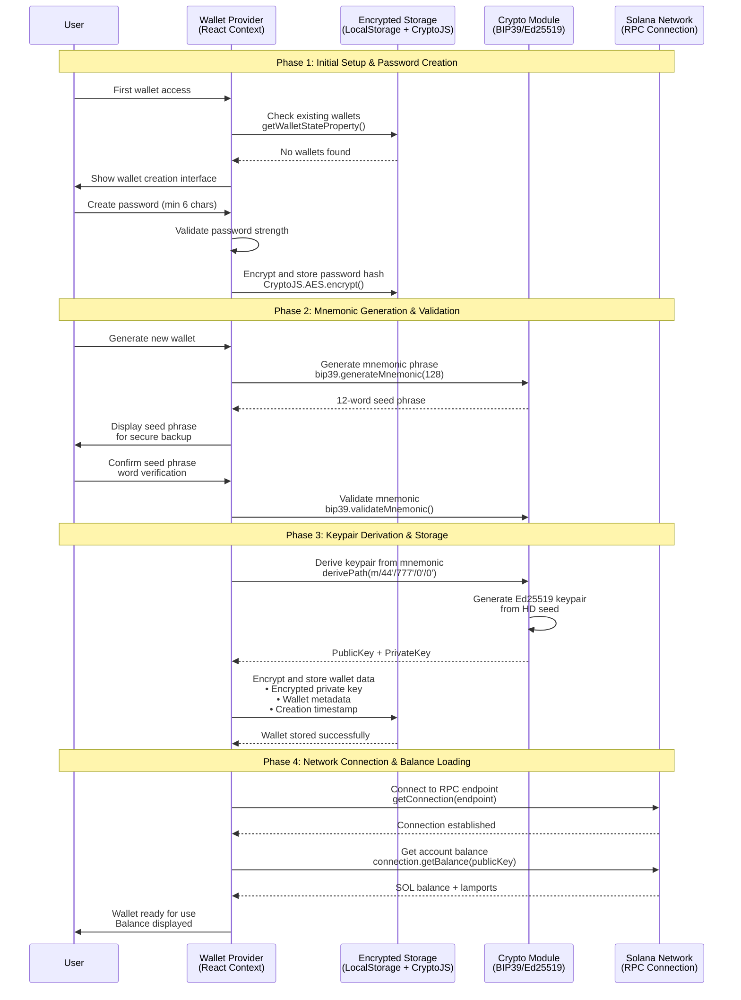
```mermaid
sequenceDiagram
    participant User as User
    participant WalletProvider as Wallet Provider<br/>(React Context)
    participant Storage as Encrypted Storage<br/>(LocalStorage + CryptoJS)
    participant Crypto as Crypto Module<br/>(BIP39/Ed25519)
    participant Solana as Solana Network<br/>(RPC Connection)

    Note over User,Solana: Phase 1: Initial Setup & Password Creation
    User->>WalletProvider: First wallet access
    WalletProvider->>Storage: Check existing wallets<br/>getWalletStateProperty()
    Storage-->>WalletProvider: No wallets found

    WalletProvider->>User: Show wallet creation interface
    User->>WalletProvider: Create password (min 6 chars)
    WalletProvider->>WalletProvider: Validate password strength
    WalletProvider->>Storage: Encrypt and store password hash<br/>CryptoJS.AES.encrypt()

    Note over User,Solana: Phase 2: Mnemonic Generation & Validation
    User->>WalletProvider: Generate new wallet
    WalletProvider->>Crypto: Generate mnemonic phrase<br/>bip39.generateMnemonic(128)
    Crypto-->>WalletProvider: 12-word seed phrase

    WalletProvider->>User: Display seed phrase<br/>for secure backup
    User->>WalletProvider: Confirm seed phrase<br/>word verification
    WalletProvider->>Crypto: Validate mnemonic<br/>bip39.validateMnemonic()

    Note over User,Solana: Phase 3: Keypair Derivation & Storage
    WalletProvider->>Crypto: Derive keypair from mnemonic<br/>derivePath(m/44'/777'/0'/0')
    Crypto->>Crypto: Generate Ed25519 keypair<br/>from HD seed
    Crypto-->>WalletProvider: PublicKey + PrivateKey

    WalletProvider->>Storage: Encrypt and store wallet data<br/>• Encrypted private key<br/>• Wallet metadata<br/>• Creation timestamp
    Storage-->>WalletProvider: Wallet stored successfully

    Note over User,Solana: Phase 4: Network Connection & Balance Loading
    WalletProvider->>Solana: Connect to RPC endpoint<br/>getConnection(endpoint)
    Solana-->>WalletProvider: Connection established
    WalletProvider->>Solana: Get account balance<br/>connection.getBalance(publicKey)
    Solana-->>WalletProvider: SOL balance + lamports

    WalletProvider->>User: Wallet ready for use<br/>Balance displayed
```

### Wallet Authentication & Session Management

#### Secure Login Flow

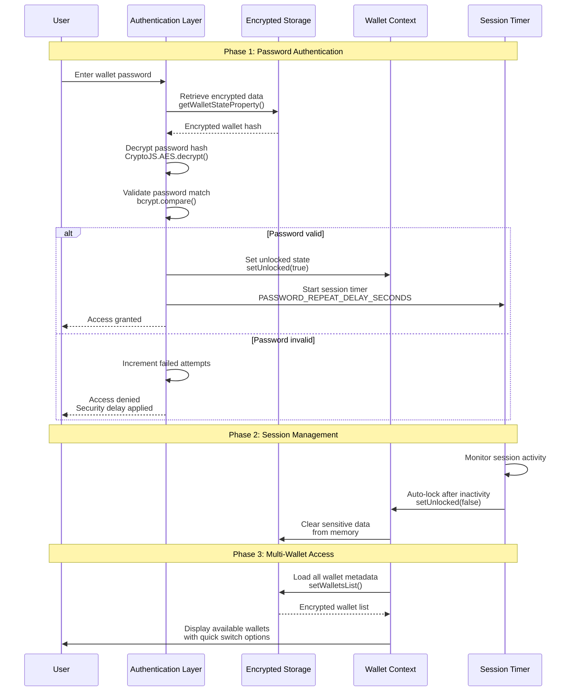
```mermaid
sequenceDiagram
    participant User as User
    participant Auth as Authentication Layer
    participant Storage as Encrypted Storage
    participant Context as Wallet Context
    participant Timer as Session Timer

    Note over User,Timer: Phase 1: Password Authentication
    User->>Auth: Enter wallet password
    Auth->>Storage: Retrieve encrypted data<br/>getWalletStateProperty()
    Storage-->>Auth: Encrypted wallet hash

    Auth->>Auth: Decrypt password hash<br/>CryptoJS.AES.decrypt()
    Auth->>Auth: Validate password match<br/>bcrypt.compare()

    alt Password valid
        Auth->>Context: Set unlocked state<br/>setUnlocked(true)
        Auth->>Timer: Start session timer<br/>PASSWORD_REPEAT_DELAY_SECONDS
        Auth-->>User: Access granted
    else Password invalid
        Auth->>Auth: Increment failed attempts
        Auth-->>User: Access denied<br/>Security delay applied
    end

    Note over User,Timer: Phase 2: Session Management
    Timer->>Timer: Monitor session activity
    Timer->>Context: Auto-lock after inactivity<br/>setUnlocked(false)
    Context->>Storage: Clear sensitive data<br/>from memory

    Note over User,Timer: Phase 3: Multi-Wallet Access
    Context->>Storage: Load all wallet metadata<br/>setWalletsList()
    Storage-->>Context: Encrypted wallet list
    Context->>User: Display available wallets<br/>with quick switch options
```

### Transaction Signing & Validation Workflow

#### Process Overview
Comprehensive transaction handling with pre-signing validation, simulation, fee calculation, and secure user confirmation before blockchain submission.

#### Detailed Technical Flow

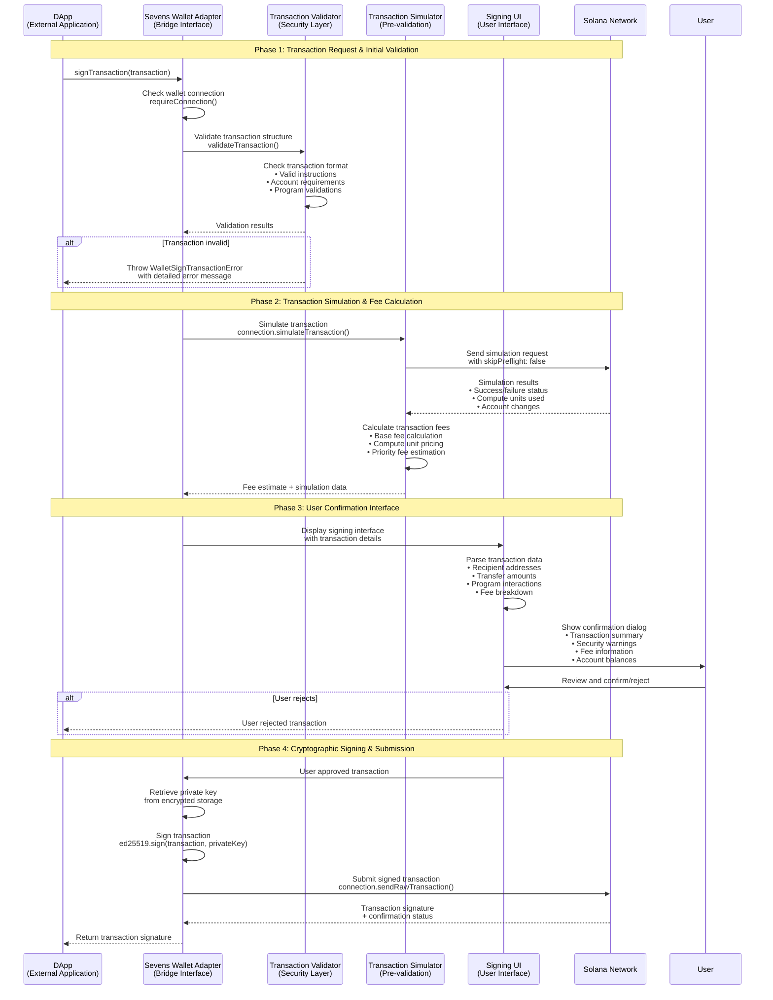
```mermaid
sequenceDiagram
    participant DApp as DApp<br/>(External Application)
    participant Adapter as Sevens Wallet Adapter<br/>(Bridge Interface)
    participant Validator as Transaction Validator<br/>(Security Layer)
    participant Simulator as Transaction Simulator<br/>(Pre-validation)
    participant UI as Signing UI<br/>(User Interface)
    participant Blockchain as Solana Network

    Note over DApp,Blockchain: Phase 1: Transaction Request & Initial Validation
    DApp->>Adapter: signTransaction(transaction)
    Adapter->>Adapter: Check wallet connection<br/>requireConnection()
    Adapter->>Validator: Validate transaction structure<br/>validateTransaction()

    Validator->>Validator: Check transaction format<br/>• Valid instructions<br/>• Account requirements<br/>• Program validations
    Validator-->>Adapter: Validation results

    alt Transaction invalid
        Validator-->>DApp: Throw WalletSignTransactionError<br/>with detailed error message
    end

    Note over DApp,Blockchain: Phase 2: Transaction Simulation & Fee Calculation
    Adapter->>Simulator: Simulate transaction<br/>connection.simulateTransaction()
    Simulator->>Blockchain: Send simulation request<br/>with skipPreflight: false
    Blockchain-->>Simulator: Simulation results<br/>• Success/failure status<br/>• Compute units used<br/>• Account changes

    Simulator->>Simulator: Calculate transaction fees<br/>• Base fee calculation<br/>• Compute unit pricing<br/>• Priority fee estimation
    Simulator-->>Adapter: Fee estimate + simulation data

    Note over DApp,Blockchain: Phase 3: User Confirmation Interface
    Adapter->>UI: Display signing interface<br/>with transaction details
    UI->>UI: Parse transaction data<br/>• Recipient addresses<br/>• Transfer amounts<br/>• Program interactions<br/>• Fee breakdown

    UI->>User: Show confirmation dialog<br/>• Transaction summary<br/>• Security warnings<br/>• Fee information<br/>• Account balances

    User->>UI: Review and confirm/reject
    alt User rejects
        UI-->>DApp: User rejected transaction
    end

    Note over DApp,Blockchain: Phase 4: Cryptographic Signing & Submission
    UI->>Adapter: User approved transaction
    Adapter->>Adapter: Retrieve private key<br/>from encrypted storage
    Adapter->>Adapter: Sign transaction<br/>ed25519.sign(transaction, privateKey)

    Adapter->>Blockchain: Submit signed transaction<br/>connection.sendRawTransaction()
    Blockchain-->>Adapter: Transaction signature<br/>+ confirmation status
    Adapter-->>DApp: Return transaction signature
```

### Token Management & SPL Operations

#### Multi-Token Workflow

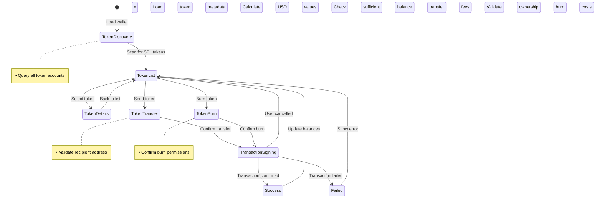
```mermaid
stateDiagram-v2
    [*] --> TokenDiscovery : Load wallet

    TokenDiscovery --> TokenList : Scan for SPL tokens
    TokenList --> TokenDetails : Select token
    TokenList --> TokenTransfer : Send token
    TokenList --> TokenBurn : Burn token

    TokenDetails --> TokenList : Back to list
    TokenTransfer --> TransactionSigning : Confirm transfer
    TokenBurn --> TransactionSigning : Confirm burn

    TransactionSigning --> Success : Transaction confirmed
    TransactionSigning --> Failed : Transaction failed
    TransactionSigning --> TokenList : User cancelled

    Success --> TokenList : Update balances
    Failed --> TokenList : Show error

    note right of TokenDiscovery : • Query all token accounts
                                  • Load token metadata
                                  • Calculate USD values

    note right of TokenTransfer : • Validate recipient address
                                 • Check sufficient balance
                                 • Calculate transfer fees

    note right of TokenBurn : • Confirm burn permissions
                             • Validate token ownership
                             • Calculate burn costs
```

### Security & Encryption Architecture

#### Data Protection Flow

```
┌────────────────────────────────────────────────────────────────────────────┐
│                           SECURITY ARCHITECTURE                            │
└────────────────────────────────────────────────────────────────────────────┘

    USER INPUT                ENCRYPTION LAYER               STORAGE LAYER
┌─────────────────┐        ┌─────────────────────┐       ┌───────────────────┐
│    Passwords    │        │    CryptoJS AES     │       │   Local Storage   │
│   Private Keys  │   ──►  │   • 256-bit keys    │  ──►  │  • Encrypted      │
│   Seed Phrases  │        │   • PBKDF2 hashing  │       │  • Compartmented  │
│   Wallet Data   │        │   • Salt generation │       │  • Versioned      │
└─────────────────┘        └─────────────────────┘       └───────────────────┘
         │                            │                            │
         ▼                            ▼                            ▼
┌─────────────────┐        ┌─────────────────────┐       ┌───────────────────┐
│ Input Validate  │        │    Key Derivation   │       │   Data Recovery   │
│  • Length check │        │  • BIP39 standard   │       │  • Backup/Restore │
│  • Format valid │        │  • Ed25519 crypto   │       │  • Migration      │
│  • Strength test│        │  • HD derivation    │       │  • Cleanup        │
└─────────────────┘        └─────────────────────┘       └───────────────────┘

                             RUNTIME PROTECTION
                     ┌─────────────────────────────────┐
                     │        Memory Management        │
                     │  • Sensitive data clearing      │
                     │  • Session timeouts             │
                     │  • Automatic locks              │
                     │  • Secure key handling          │
                     └─────────────────────────────────┘
```

### Multi-Language Support Workflow

#### Internationalization Architecture

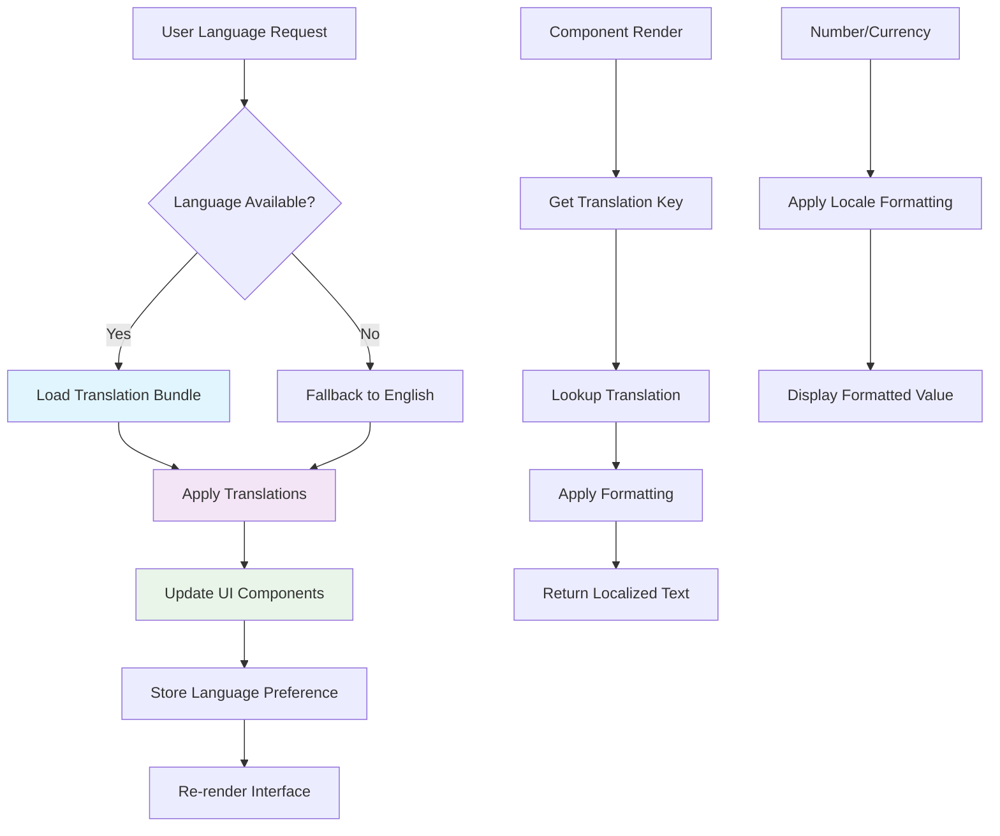
```mermaid
flowchart TD
    A[User Language Request] --> B{Language Available?}
    B -->|Yes| C[Load Translation Bundle]
    B -->|No| D[Fallback to English]

    C --> E[Apply Translations]
    D --> E

    E --> F[Update UI Components]
    F --> G[Store Language Preference]
    G --> H[Re-render Interface]

    I[Component Render] --> J[Get Translation Key]
    J --> K[Lookup Translation]
    K --> L[Apply Formatting]
    L --> M[Return Localized Text]

    N[Number/Currency] --> O[Apply Locale Formatting]
    O --> P[Display Formatted Value]

    style C fill:#e1f5fe
    style E fill:#f3e5f5
    style F fill:#e8f5e8
```

### Wallet Adapter Integration Architecture

#### Process Overview
The Sevens Wallet Adapter provides seamless integration with existing Solana dApps through standard wallet adapter interface, maintaining full Phantom API compatibility while adding custom functionality.

#### Component Integration Flow

```
┌─────────────────────────────────────────────────────────────────────┐
│                      WALLET ADAPTER ECOSYSTEM                       │
└─────────────────────────────────────────────────────────────────────┘

    EXTERNAL DAPP           ADAPTER BRIDGE              WALLET CORE
┌─────────────────┐      ┌─────────────────┐        ┌─────────────────┐
│ DApp Interface  │      │ Sevens Adapter  │        │ Wallet Context  │
│                 │      │                 │        │                 │
│ • connect()     │◄────►│ • Phantom API   │◄──────►│ • State Mgmt    │
│ • signTx()      │      │   Compatibility │        │ • Crypto Ops    │
│ • signMsg()     │      │ • Event Bridge  │        │ • Storage       │
│ • disconnect()  │      │ • Error Mapping │        │ • Security      │
└─────────────────┘      └─────────────────┘        └─────────────────┘
         │                         │                         │
         ▼                         ▼                         ▼
┌─────────────────┐      ┌─────────────────┐        ┌─────────────────┐
│ Standard Events │      │ Custom Features │        │  UI Components  │
│ • connect       │      │ • Multi-wallet  │        │ • SignTx Dialog │
│ • disconnect    │      │ • Multi-language│        │ • Settings UI   │
│ • accountChange │      │ • Config system │        │ • Token Mgmt    │
└─────────────────┘      └─────────────────┘        └─────────────────┘
```

#### Adapter Lifecycle Management

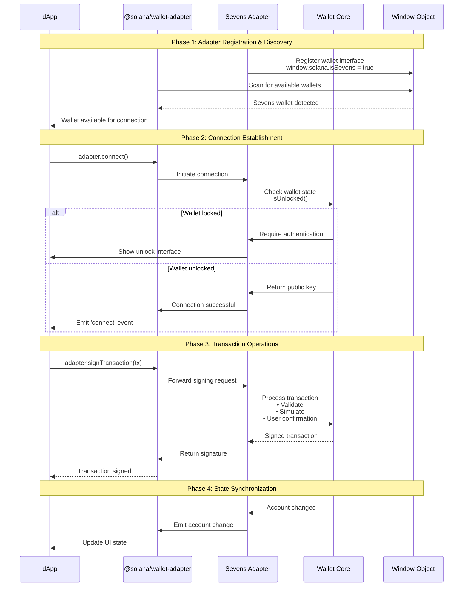
```mermaid
sequenceDiagram
    participant DApp as dApp
    participant WalletAdapter as @solana/wallet-adapter
    participant SevensAdapter as Sevens Adapter
    participant WalletCore as Wallet Core
    participant Window as Window Object

    Note over DApp,Window: Phase 1: Adapter Registration & Discovery
    SevensAdapter->>Window: Register wallet interface<br/>window.solana.isSevens = true
    WalletAdapter->>Window: Scan for available wallets
    Window-->>WalletAdapter: Sevens wallet detected
    WalletAdapter-->>DApp: Wallet available for connection

    Note over DApp,Window: Phase 2: Connection Establishment
    DApp->>WalletAdapter: adapter.connect()
    WalletAdapter->>SevensAdapter: Initiate connection
    SevensAdapter->>WalletCore: Check wallet state<br/>isUnlocked()

    alt Wallet locked
        WalletCore->>SevensAdapter: Require authentication
        SevensAdapter->>DApp: Show unlock interface
    else Wallet unlocked
        WalletCore->>SevensAdapter: Return public key
        SevensAdapter->>WalletAdapter: Connection successful
        WalletAdapter->>DApp: Emit 'connect' event
    end

    Note over DApp,Window: Phase 3: Transaction Operations
    DApp->>WalletAdapter: adapter.signTransaction(tx)
    WalletAdapter->>SevensAdapter: Forward signing request
    SevensAdapter->>WalletCore: Process transaction<br/>• Validate<br/>• Simulate<br/>• User confirmation
    WalletCore-->>SevensAdapter: Signed transaction
    SevensAdapter-->>WalletAdapter: Return signature
    WalletAdapter-->>DApp: Transaction signed

    Note over DApp,Window: Phase 4: State Synchronization
    WalletCore->>SevensAdapter: Account changed
    SevensAdapter->>WalletAdapter: Emit account change
    WalletAdapter->>DApp: Update UI state
```

## Token Operations

### SPL Token Support
- Automatic token account creation
- Token transfers between addresses
- Token burning capabilities
- Balance checking and display
- Custom token metadata integration

### Advanced Features
- Transaction simulation before signing
- Gas fee estimation and display
- Batch transaction support
- Custom program interaction via Anchor

## Development

### Prerequisites

- Node.js 16+
- React 18+
- @solana/web3.js
- @solana/wallet-adapter-base

### Peer Dependencies

```json
{
  "react": "^18.0.0",
  "react-dom": "^18.0.0"
}
```

### TypeScript Support

The library includes comprehensive TypeScript definitions:

```typescript
import type {
  WalletContextType,
  WalletData,
  TransactionResult
} from 'sevens-wallet-react'
```

---

## Sevens Ecosystem

The Sevens platform consists of four interconnected projects that work together to provide a complete blockchain tokenization solution:

### **[Sevens Backoffice](https://github.com/anatolii-semochko/sevens-backoffice)**
*Administrative control center and revenue management platform*
- **Technology**: PHP/Symfony, React/Redux, MySQL, Docker
- **Purpose**: Administrative dashboard for token operations monitoring, fee configuration, user management, and financial analytics
- **Key Features**: Real-time transaction monitoring, emergency system controls, tariff management, comprehensive reporting

### **[Sevens Platform](https://github.com/anatolii-semochko/sevens-platform)**
*Main user-facing application for digital material tokenization and trading*
- **Technology**: PHP/Symfony, React/TypeScript, MySQL, AWS S3, Docker
- **Purpose**: Complete web platform for creating, managing, and trading blockchain tokens representing digital materials
- **Key Features**: Token creation & management, marketplace functionality, wallet integration, file storage & CDN

### **[Sevens Smart Contracts](https://github.com/anatolii-semochko/sevens-smartcontracts)**
*Enterprise-grade NFT marketplace infrastructure built on Solana*
- **Technology**: Rust, Anchor Framework, Solana blockchain
- **Purpose**: Dual-contract token ecosystem with hash-validated NFTs and built-in marketplace functionality
- **Key Features**: Hash-based uniqueness validation, dynamic fee collection, inter-contract communication, governance layer

### **[Sevens Wallet React](https://github.com/anatolii-semochko/custom-solana-wallet-react)**
*Custom Solana wallet interface library with extended functionality*
- **Technology**: React, TypeScript, Solana Web3.js, CryptoJS
- **Purpose**: Comprehensive React library for building custom wallet interfaces compatible with Phantom API
- **Key Features**: Multi-language support, encrypted storage, transaction validation, modular architecture

### Architecture Overview

```
┌──────────────────────────────────────────────────────────────────┐
│                        SEVENS ECOSYSTEM                          │
│                                                                  │
│  ┌─────────────────┐    ┌─────────────────┐    ┌──────────────┐  │
│  │   BACKOFFICE    │    │    PLATFORM     │    │   WALLET     │  │
│  │   (Admin)       │◄──►│  (User App)     │◄──►│  (Library)   │  │
│  │ • Fee Config    │    │ • Token Trading │    │ • UI Comps   │  │
│  │ • Monitoring    │    │ • Marketplace   │    │ • Security   │  │
│  │ • Analytics     │    │ • File Storage  │    │ • Multi-lang │  │
│  └─────────────────┘    └─────────────────┘    └──────────────┘  │
│           │                      │                     │         │
│           │                      │                     │         │
│           └──────────────────────┼─────────────────────┘         │
│                                  │                               │
│                  ┌───────────────▼───────────────┐               │
│                  │        SMART CONTRACTS        │               │
│                  │         (Blockchain)          │               │
│                  │     • Token Operations        │               │
│                  │     • Marketplace Logic       │               │
│                  │     • Fee Collection          │               │
│                  │     • Hash Validation         │               │
│                  └───────────────────────────────┘               │
└──────────────────────────────────────────────────────────────────┘
```

This integrated ecosystem provides a complete solution for blockchain-based digital asset tokenization, from smart contract infrastructure to user interfaces and administrative tools.

---

## Contributing

1. Fork the repository
2. Create your feature branch (`git checkout -b feature/amazing-feature`)
3. Commit your changes (`git commit -m 'Add some amazing feature'`)
4. Push to the branch (`git push origin feature/amazing-feature`)
5. Open a Pull Request

## Support

For questions and support, please open an issue on the [GitHub repository](https://github.com/anatolii-semochko/custom-solana-wallet-react/issues).

## License

MIT License

## Security Notice
**Note**: This library is designed for educational and development purposes. Always follow security best practices when handling cryptocurrency wallets in production applications.